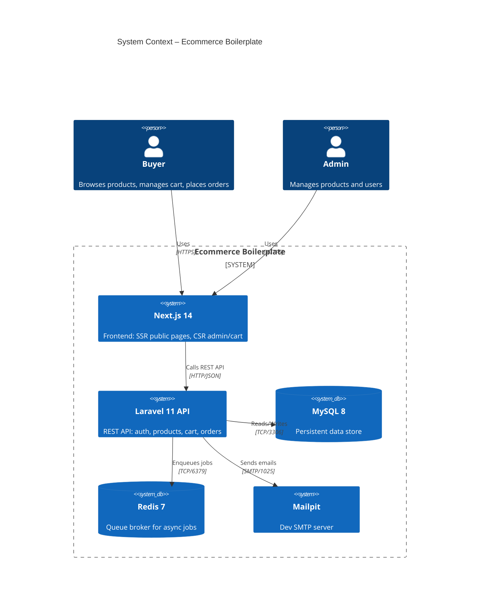
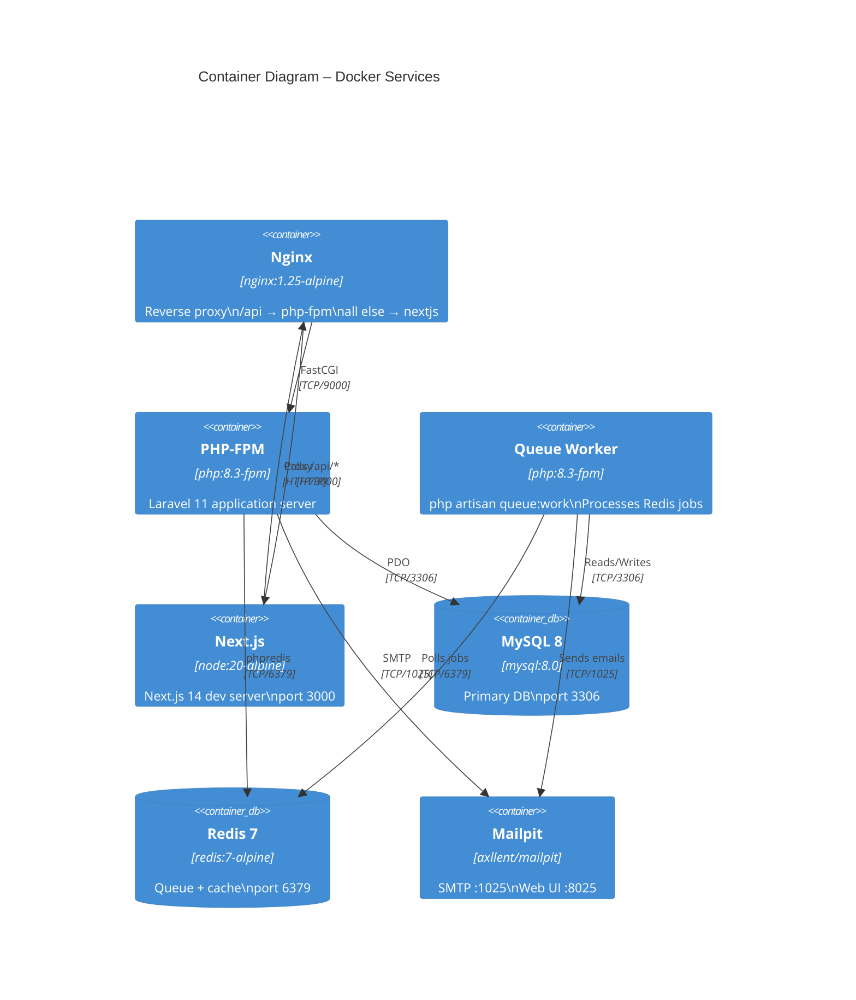
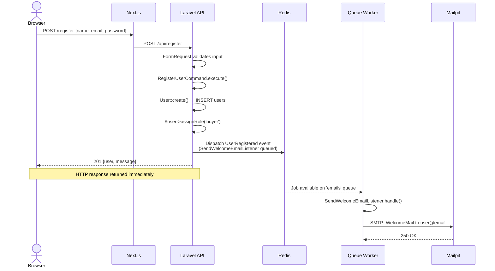
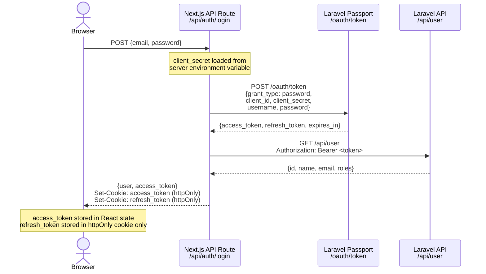

# Architecture Documentation

## Overview

Ecommerce Boilerplate is a **modular monolith** that applies Domain-Driven Design (DDD) concepts within a single deployable unit. The primary architectural drivers are:

1. **Developer experience**: Clear module boundaries enable teams to work in parallel without stepping on each other.
2. **Testability**: Domain logic depends on abstractions (Repository interfaces), not on Eloquent directly.
3. **Security**: OAuth secrets never reach the browser thanks to the Next.js API Route proxy pattern.
4. **Async by default**: Post-registration emails are queued on Redis, keeping the HTTP response fast.
5. **Hybrid rendering**: Public pages are SSR/ISR for SEO; admin/cart are Client-side for interactivity.

---

## System Context Diagram



---

## Container (Docker) Diagram



---

## Bounded Contexts

### UserManagement
**Responsibility**: User identity, authentication lifecycle, welcome communication.

| Layer | Contents |
|-------|---------|
| Domain | `User` model (aggregate root), `UserRegistered` event, `UserRepositoryInterface` |
| Application | `RegisterUserCommand`, `GetUsersQuery`, `SendWelcomeEmailListener` |
| Infrastructure | `EloquentUserRepository`, `WelcomeMail` mailable |

### ProductCatalog
**Responsibility**: Product inventory, visibility, search.

| Layer | Contents |
|-------|---------|
| Domain | `Product` model, `ProductRepositoryInterface` |
| Application | `CreateProductCommand`, `UpdateProductCommand`, `GetProductsQuery` |
| Infrastructure | `EloquentProductRepository` |

### Ordering
**Responsibility**: Shopping cart, order lifecycle, checkout.

| Layer | Contents |
|-------|---------|
| Domain | `Cart`, `CartItem`, `Order`, `OrderItem` models; `CartRepositoryInterface`, `OrderRepositoryInterface`; `OrderFactory` |
| Application | (CartController acts as command handler for simplicity) |
| Infrastructure | `EloquentCartRepository`, `EloquentOrderRepository` |

---

## Entity Relationship Diagram

```mermaid
erDiagram
    users {
        bigint id PK
        string name
        string email UK
        string password
        timestamp email_verified_at
        timestamp deleted_at
        timestamps
    }

    roles {
        bigint id PK
        string name
        string guard_name
    }

    permissions {
        bigint id PK
        string name
        string guard_name
    }

    model_has_roles {
        bigint role_id FK
        string model_type
        bigint model_id
    }

    role_has_permissions {
        bigint permission_id FK
        bigint role_id FK
    }

    products {
        bigint id PK
        string name
        string slug UK
        text description
        decimal price
        int stock
        string image
        boolean is_active
        bigint created_by FK
        timestamp deleted_at
        timestamps
    }

    carts {
        bigint id PK
        bigint user_id FK
        string session_id
        timestamps
    }

    cart_items {
        bigint id PK
        bigint cart_id FK
        bigint product_id FK
        int quantity
        decimal price
        timestamps
    }

    orders {
        bigint id PK
        bigint user_id FK
        enum status
        decimal total_amount
        text shipping_address
        timestamps
    }

    order_items {
        bigint id PK
        bigint order_id FK
        bigint product_id FK
        string product_name
        int quantity
        decimal unit_price
        timestamps
    }

    users ||--o{ model_has_roles : "has"
    roles ||--o{ model_has_roles : "assigned via"
    roles ||--o{ role_has_permissions : "has"
    permissions ||--o{ role_has_permissions : "granted via"
    users ||--o{ products : "creates (admin)"
    users ||--o{ carts : "owns"
    carts ||--o{ cart_items : "contains"
    products ||--o{ cart_items : "added to"
    users ||--o{ orders : "places"
    orders ||--o{ order_items : "contains"
    products ||--o{ order_items : "referenced in"
```

---

## Sequence: User Registration with Welcome Email



---

## Sequence: Login with Passport (Password Grant)



---

## Design Patterns Applied

| Pattern | Location | Purpose |
|---------|----------|---------|
| **Repository** | `Domain/Repositories/*.Interface.php` → `Infrastructure/Repositories/Eloquent*.php` | Decouples domain from Eloquent |
| **Command** | `Application/Commands/*Command.php` | Encapsulates write operations (CQRS write side) |
| **Query Handler** | `Application/Queries/*Query.php` | Encapsulates read operations (CQRS read side) |
| **Factory** | `Ordering/Domain/Factories/OrderFactory.php` | Creates Orders from Carts atomically |
| **Observer/Event** | `UserRegistered` + `SendWelcomeEmailListener` | Decouples registration from emailing |
| **Pipeline** | FormRequest → Controller → Command | Validation stages before business logic |
| **API Resource** | `Http/Resources/*.php` | Transforms domain models to JSON contracts |
| **Proxy** | Next.js `/api/auth/login` route | Hides OAuth client_secret from browser |
